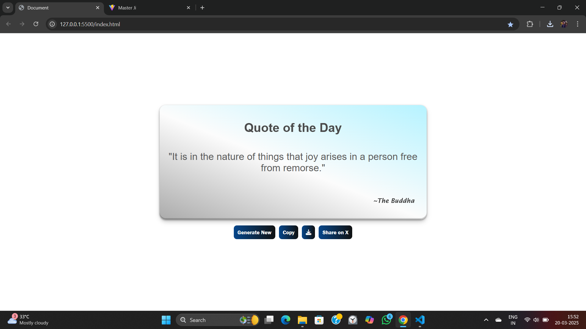

# Random Quote Generator 🤖

## Features 🛠️

- **Generate New Quote:** Click on the "Generate New" button to fetch a new random quote.
- **Copy to Clipboard:** Click the "Copy" button to copy the displayed quote.
- **Download as Image:** Click the "Download" button to save the quote as an image.
- **Share to X (Twitter):** Click the "Share to X" button to post the quote directly on X.

## Usage ✍

1. Click on the **Generate New** button to fetch a fresh quote.
2. If you want to save the quote:
   - Click **Copy** to copy it to your clipboard.
   - Click **Download** to save it as an image.
   - Click **Share to X** to post it on X.

## Technologies Used 👨🏻‍💻 </>

- HTML
- CSS
- JavaScript
- Fetch API (for fetching quotes)

## Screenshots 📸

## Deployed Link 🔗

[Random Quote Generator](https://koushik-chowdhury.github.io/Cohort/Assignemnts/quote-generator/)